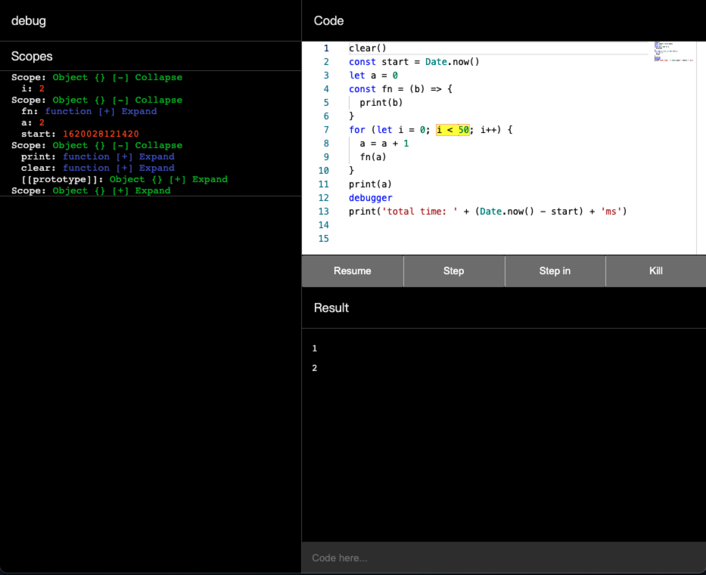

# Flat js

flow flattening for javascript

================

## Motivation

1. Learn how javascript internally works, and evaluate whether did I learn it correctly.
2. Bypass the csp `eval` restriction with minimal size overhead.
3. Obfuscate codes across all functions for obfuscation purpose
4. Learn how do debuggers work and try to implement it



## To run this project

```sh
npm install
npx tsc --watch
```

## Usage

The example

```sh
node ./lib/cli.js ./src/__tests__/fixures/loader.js > ./example/loader.js
node ./lib/cli.js --json ./src/__tests__/fixures/bad-code.js > ./example/bad-code.json
node ./lib/cli.js --json ./src/__tests__/fixures/jquery.js > ./example/jquery.json
```

## Design

Emulate a javascript interpreter that interpret intermediate product of javascript parser.

1. read code
2. parsing into AST (typescript)
3. extract functions
4. resolve the variable and what scope it belongs to
5. generation instructions from AST
    1. offset is not known yet, only the length of instruction)
6. resolving offset of instructions
    1. concat the all together and get the offset of the instructions
7. generate opcode and data session from instructions
8. generate output and send to stdout
    1. combine with interpreter and interpreted by interpreter
    2. or as a json as an payload

The interpreter didn't execute code directly.  
It execute opcodes generated by above process instead.  
So the size can be pretty small because you don't need the whole parser to parse JavaScript.
