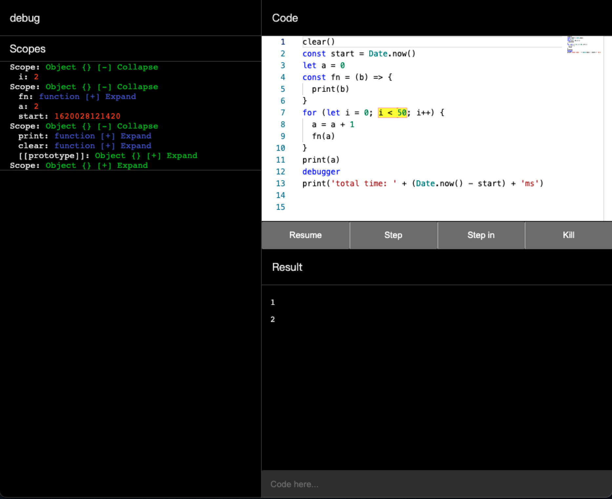

# Flat JS

JavaScript bytecode compiler and interpreter: it compiles JS source to a flat opcode stream and runs it with a small bundled runtime (`src/compiler.ts`, `src/runtime.ts`).

---

## Motivation

1. Learn how JavaScript is implemented end to end.
2. Run user code without relying on host `eval` where that matters (e.g. CSP).
3. Optionally ship bytecode + tiny runtime instead of full source.
4. Experiment with debuggers: stepping, source maps, and a browser UI.



---

## Repository layout

| Path | Role |
|------|------|
| `src/` | Compiler, opcode runtime, tests (`npm run build` → `lib/`). |
| `web/` | Vue 2 app: Monaco editor, debugger UI, optional **robot arena** (`web/game/sim.ts`, `web/components/game-canvas.vue`). |
| `plan/` | Design notes for the canvas game (`plan/README.md`). |

Public API (`src/index.ts`): `compile`, `run`, `getExecution`. `run` accepts an optional trailing `getDebugFunction` so nested evaluation (e.g. REPL or polyfills) uses the same custom `debugger` / pause hook as the main execution.

---

## Setup

```sh
npm install
npm run build        # compile TypeScript once → lib/
npm run watch        # compile TypeScript in watch mode
```

---

## CLI

```sh
node ./lib/cli.js [flags] <input-file>
```

| Flag | Description |
|------|-------------|
| *(none)* | Emit a self-contained, minified JS file (runtime + bytecode). |
| `--json` | Emit bytecode as JSON (`{ "p": "<base64>" }`). |
| `--bin` | Emit raw bytecode only: little-endian `Int32` words (length × 4 bytes). |
| `--debug` | Keep output readable; print minified source to stderr. |
| `--pretty` | Skip minification of the input before compiling. |

```sh
node ./lib/cli.js ./src/__tests__/fixures/loader.js > ./example/loader.js
node ./lib/cli.js --bin ./src/__tests__/fixures/bad-code.js > ./example/bad-code.bin
npm run build-example   # regenerate example outputs (loader.js + *.bin)
```

---

## Web app (debugger + game)

```sh
npm run dev-web      # webpack dev server
npm run build-web    # production bundle → dist-web/
npm run serve-web    # static server for dist-web/
```

The web shell loads user code with `compile` / `getExecution`, drives `execution[Fields.step]` for run / pause / step, and maps `execution[Fields.ptr]` through `debugInfo.sourceMap` for Monaco highlights.

**Game mode** (when enabled in the UI): builtins talk to a 2D sim (`web/game/sim.ts`): `clear`, `print`, `rotate`, `move`, `lastMoveDistance`, `shoot`, `scan`, `won`, etc. World time advances on a fixed tick cadence; long actions can span multiple ticks. See snippet comments in `web/index.vue` for parameter ranges.

**Host behavior (browser only)**

- **`Math.random`** is redirected to a deterministic PRNG (`web/vm-deterministic-math.ts`); call `resetVmMathRandom()` before each run so runs replay the same sequence.
- **Common `Array.prototype` methods that take callbacks** are redirected to VM-compiled polyfills (`web/vm-host-redirects.ts`): `forEach`, `map`, `filter`, `find`, `findIndex`, `some`, `every`, `reduce`, `reduceRight`, and `flatMap` when present on the host. Redirects are rebuilt in `setupExecution` so `debugger` and the custom pause path match the main program. Polyfill bytecode runs on the **same VM stack** as user code (native builtins are not used for those calls).
- **Editor highlights** ignore host polyfill programs: their bytecode buffers are tracked in `hostPolyfillProgramSet` so the UI does not map polyfill `ptr` values into the user’s source (avoids bogus ranges while stepping through `forEach` and similar).

### Debugger controls

| State | Actions |
|-------|---------|
| Idle | **Run**, **Run and pause** |
| Running | **Pause**, **Kill** |
| Paused | **Resume**, **Step**, **Step in**, **Kill** |

When paused, a REPL at the bottom of the result pane evaluates expressions in the current VM scope (`compile` with `evalMode: true`).

---

## Testing

```sh
npm test                  # Jest, all suites
npm run test:coverage     # coverage
npm run serve-coverage    # open HTML coverage report
```

---

## Design (implementation)

### Compilation pipeline

1. Parse with the TypeScript compiler API.
2. Discover functions and scopes; resolve variable references.
3. Emit opcodes (lengths first; offsets fixed after concatenation).
4. Output program + text sections; optional range metadata for debugging.

### Runtime

Execution is a flat opcode interpreter (no parser at run time). Supported features include closures, `var`/`let`/`const`, arrow functions, `async`/`await`, generators (`yield` / `yield*`), ES6 `class` (including `super`), `try`/`catch`/`finally`, loops, `switch`, `new`, prototypes, `Proxy`, compiled `eval`, and `debugger` (honors a host-provided pause callback when installed). **`functionRedirects`**: host may replace native functions (e.g. `Math.random`, `Array.prototype.forEach`) with other functions; when the replacement is itself a VM function, calls use the normal in-VM call path (same stack) rather than always going through `Reflect.apply` into a nested runner.
