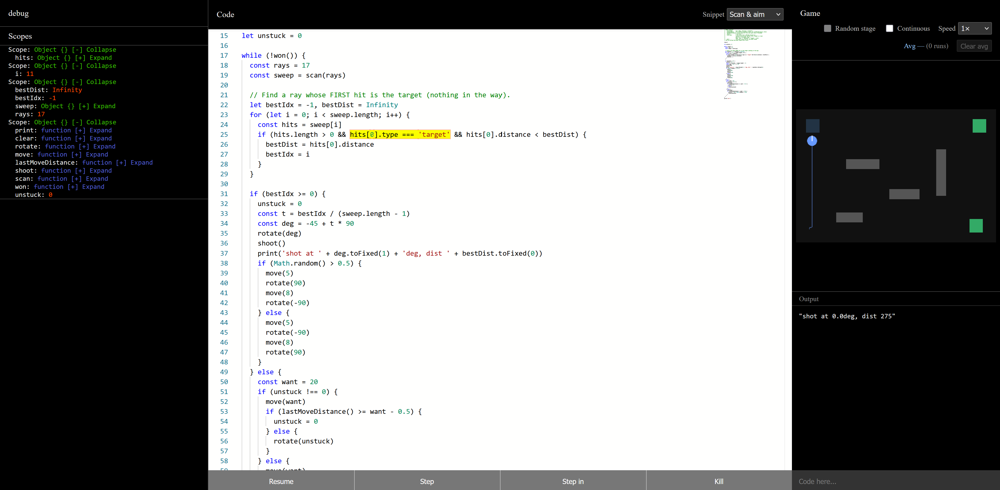

# Flat JS

JavaScript bytecode compiler and interpreter: it compiles JS source to a flat opcode stream and runs it with the bundled opcode runtime. The public API is re-exported from `src/index.ts`, with compiler and runtime modules split under `src/compiler/` and `src/runtime/`.

---

## Motivation

1. Learn how JavaScript is implemented end to end.
2. Run user code without relying on host `eval` where that matters (e.g. CSP).
3. Optionally ship bytecode + tiny runtime instead of full source.
4. Experiment with debuggers: stepping, source maps, and a browser UI.



---

## Repository layout

| Path | Role |
|------|------|
| `src/` | Compiler, opcode runtime, CLI entrypoint, and Jest tests (`npm run build` writes `lib/`). |
| `web/` | Vue 3 app: Monaco editor, debugger UI, optional **robot arena** (`web/game/sim.ts`, `web/components/game-canvas.vue`). |
| `plan/` | Design notes, Test262 scan summaries, and VM state-serialization planning. |
| `scripts/` | Build/test helpers, including runtime inline assembly and Test262 preprocessing. |
| `example/` | Generated browser loader and bytecode examples from `npm run build-example`. |

Public API (`src/index.ts`): `compile`, `run`, `getExecution`, and `compileAndRun`. Runtime helpers in `src/runtime.ts` also export `Fields`, `FrameType`, debug-scope helpers, and runtime types. `run` / `getExecution` accept optional debug callback, compile, and function-redirect hooks so nested evaluation (e.g. REPL or polyfills) uses the same custom `debugger` / pause path as the main execution.

---

## Current status

- The core compiler/runtime supports the main debugger workflows and a broad ES feature set, but language coverage is still actively being improved.
- Focused Test262 work is tracked under `plan/test262-language-fix-tracker.md`, with generated summary files in `plan/test262-*-summary.md`; static scope name-elision follow-up is tracked under `plan/static-scope-name-elision-tracker.md`; larger current-scan JSON artifacts may also be produced locally during investigation.
- Test262 status as of 2026-05-04:

  Harness slice counts scenarios generated by `test262-harness`:

  | Category | Count | Status | Why |
  |----------|------:|--------|-----|
  | Supported harness scenarios | 228 | Passing | The harness helpers used by current language scans work through the Flat JS preprocessor. |
  | Same-realm harness scenarios | 4 | Deferred | `$262` same-realm constructor identity is not implemented yet (`assert-throws-same-realm.js` and `asyncHelpers-throwsAsync-same-realm.js`, each default + strict). |
  | Total harness scenarios | 232 | Mostly passing | Dedicated harness slice is green except the same-realm support gap above. |

  Language scan counts source files under `node_modules/test262/test/language`; failure buckets come from `plan/test262-language-summary.md`.

  | Category | Count | Status | Why |
  |----------|------:|--------|-----|
  | Not recorded as failing | 17,856 | Supported by current target | These files did not appear in the latest full language failure summary. The target is script-mode language/runtime support, not every current ECMAScript proposal surface. |
  | Actionable intended runtime / early-error failures | 0 | Closed for now | The latest full scan has no known supported-runtime semantic or supported early-error failures left. |
  | Intended parser-delegation gaps | 15 | Deferred | Valid script forms TypeScript still rejects or parses into the wrong shape for this compiler: Unicode 16/17 identifiers, sloppy `let` loop-head identifiers, escaped contextual keywords, `await` as a global binding name, and one `for-of` destructuring initializer grammar case. |
  | Unsupported syntax | 4,876 | Out of scope | Features the compiler/runtime does not model yet, including modules/import/export, explicit resource management, decorators, private names, class fields, class static blocks, and related modern class-element grammar. |
  | Unsupported behavior | 1,051 | Out of scope | Files that parse far enough to run into unsupported semantic areas, mostly tied to the syntax families above or host/module behavior that Flat JS does not currently implement. |
  | Unsupported parser syntax | 102 | Out of scope | Parser shapes that are not part of the current intended script-mode target, distinct from the 15 valid-script parser-delegation gaps being tracked. |
  | Native harness issue | 2 | Deferred | Native Node / harness behavior, such as unhandled-rejection policy, not a Flat JS runtime semantic failure. |
  | Test262 stress timeout | 6 | Deferred | Exhaustive comment/RegExp stress files perform 65,536 dynamic eval compilations; representative semantic samples pass, so these are tracked as performance/stress work. |
  | TypeScript compiler crash | 1 | Upstream | One object generator-method property-name file crashes TypeScript 6 diagnostics with maximum call stack exceeded; do not workaround TypeScript checker crashes in Flat JS. |
  | Total recorded failing files | 6,053 | Not green | `15` intended parser-delegation files plus `6,038` out-of-scope/deferred files. |
- The web app includes the Monaco debugger plus the robot arena simulation, deterministic browser `Math.random`, and VM-compiled host polyfills for callback-heavy array methods.
- VM state serialization is not implemented yet. The current design and implementation phases are captured in `plan/vm-state-serialization-plan.md`.

---

## Setup

```sh
npm install
npm run build:tsc    # type-check/compile src TypeScript
npm run build        # assemble bundled runtime + compile TypeScript to lib/
npm run build:compiler-bundle
npm run check:selfhost-compiler
npm run watch        # compile TypeScript in watch mode
```

---

## Self-host compiler bundle

`npm run build:compiler-bundle` first runs the normal TypeScript build so `const enum` values are inlined by `tsc`, then webpack bundles `lib/compiler.js` and the full `typescript` package into `lib/compiler-with-typescript.cjs`. The bundle target is Node CJS: TypeScript is included in the output file, while Node built-ins such as `fs`, `path`, and `os` still come from the host.

`npm run check:selfhost-compiler` builds that bundle, requires it natively, compiles the bundled compiler with Flat JS, runs the compiled bundle inside the VM, and calls the VM-exported `compile('1+1', { evalMode: true })`.

---

## CLI

```sh
node ./lib/cli.js [flags] <input-file>
```

| Flag | Description |
|------|-------------|
| *(none)* | Emit a self-contained, minified JS file (runtime + bytecode). |
| `--json` | Emit bytecode as JSON (`{ "p": "<base64>" }`). |
| `--bin` | Emit raw bytecode only: little-endian `Int32` words (length × 4 bytes). |
| `--gzip` | With `--bin`: gzip-compress that output (browser: `DecompressionStream('gzip')` then `Int32Array`). |
| `--debug` | Keep output readable; print minified source to stderr. |
| `--pretty` | Skip minification of the input before compiling. |
| `--strip-runtime` | Remove unused runtime opcode handlers from emitted self-contained output. |
| `--merge-opcodes-from <file>` | With `--strip-runtime`: keep opcodes needed by another input file too. |

```sh
node ./lib/cli.js ./src/__tests__/fixures/loader.js > ./example/loader.js
node ./lib/cli.js --bin --gzip ./src/__tests__/fixures/bad-code.js > ./example/bad-code.bin.gz
npm run build-example   # regenerate example outputs (loader.js + *.bin.gz)
npm run build-example:opcode-kitchen-sink
```

---

## Web app (debugger + game)

```sh
npm run dev-web      # webpack dev server
npm run build-web    # production bundle → dist-web/
npm run serve-web    # static server for dist-web/
```

The web shell loads user code with `compile` / `getExecution`, drives `execution[Fields.step]` for run / pause / step, and maps `execution[Fields.ptr]` through `debugInfo.sourceMap` for Monaco highlights.

**Game mode** (when enabled in the UI): builtins talk to a 2D sim (`web/game/sim.ts`): `clear`, `print`, `rotate`, `move`, `lastMoveDistance`, `shoot`, `scan`, `won`, etc. World time advances on a fixed tick cadence; `move`, `rotate`, and `shoot` enqueue sim actions while the VM keeps running, and `scan` / `lastMoveDistance` pause VM progress until queued actions and read timing finish. See snippets and comments in `web/game/code-snippets.ts` for the user-facing game API.

**Host behavior (browser only)**

- **`Math.random`** is redirected to a deterministic PRNG (`web/vm-deterministic-math.ts`); call `resetVmMathRandom()` before each run so runs replay the same sequence.
- **Common `Array.prototype` methods that take callbacks** are redirected to VM-compiled polyfills (`web/vm-host-redirects.ts`): `forEach`, `map`, `filter`, `find`, `findIndex`, `some`, `every`, `reduce`, `reduceRight`, and `flatMap` when present on the host. Redirects are rebuilt in `setupExecution` so `debugger` and the custom pause path match the main program. Polyfill bytecode runs on the **same VM stack** as user code (native builtins are not used for those calls).
- **Editor highlights** ignore host polyfill programs: their bytecode buffers are tracked in `hostPolyfillProgramSet` so the UI does not map polyfill `ptr` values into the user’s source (avoids bogus ranges while stepping through `forEach` and similar).

### Debugger controls

| State | Actions |
|-------|---------|
| Idle | **Run**, **Run and pause** |
| Running | **Pause**, **Kill** |
| Paused | **Resume**, **Step**, **Step in**, **Kill** |

When paused, a REPL at the bottom of the result pane evaluates expressions in the current VM scope (`compile` with `evalMode: true`).

---

## Testing

```sh
npm test                  # Jest, all suites
npm run test:slow         # Jest with RUN_SLOW_TESTS=1
npm run test:bench        # visual stepping benchmark suite
npm run test:coverage     # coverage
npm run serve-coverage    # open HTML coverage report
npm run test262:smoke     # one small Test262 smoke case
npm run test262           # broad Test262 harness run
```

`npm run test262` is a broad conformance run and is expected to fail while out-of-scope/deferred language and harness areas remain. For targeted language work, prefer focused scans with `plan/test262-language-scan.js` and keep `plan/test262-language-fix-tracker.md` plus the status notes above in sync when the expected status changes.

---

## Design (implementation)

### Compilation pipeline

1. Parse with the TypeScript compiler API.
2. Discover functions and scopes; resolve variable references.
3. Emit opcodes (lengths first; offsets fixed after concatenation).
4. Output program + text sections; optional range metadata for debugging.

### Runtime

Execution is a flat opcode interpreter (no parser at run time). Supported features include closures, `var`/`let`/`const`, destructuring, arrow functions, `async`/`await`, generators and async generators (`yield` / `yield*`), ES6 `class` (including `super`), `try`/`catch`/`finally`, `with`, labeled control flow, loops, `switch`, `new`, prototypes, `Proxy`, compiled `eval`, and `debugger` (honors a host-provided pause callback when installed). **`functionRedirects`**: host may replace native functions (e.g. `Math.random`, `Array.prototype.forEach`) with other functions; when the replacement is itself a VM function, calls use the normal in-VM call path (same stack) rather than always going through `Reflect.apply` into a nested runner.
